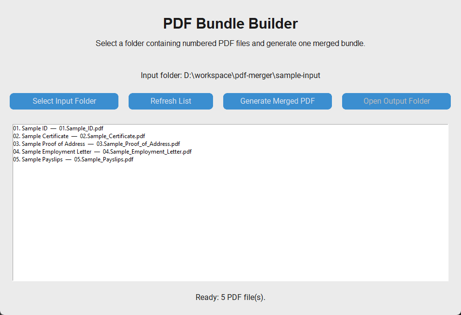
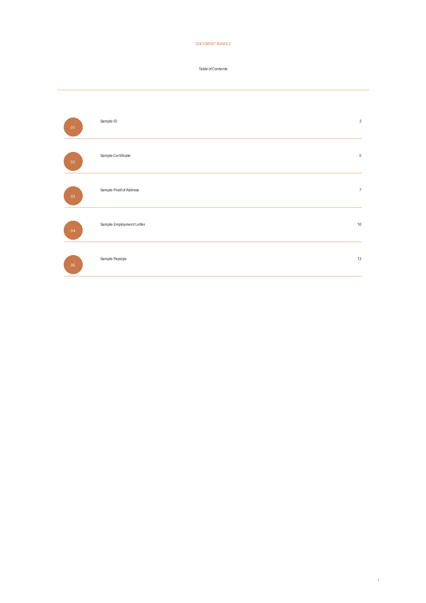
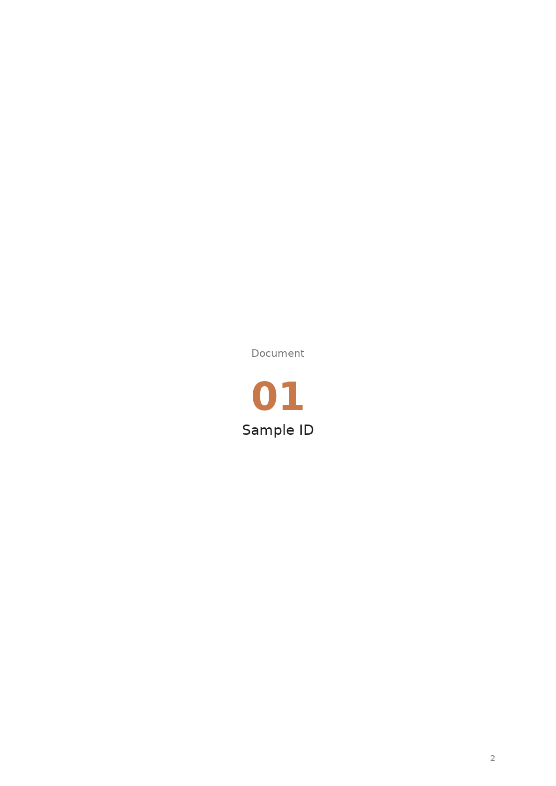

# PDF Bundle Builder

Privacy-first offline desktop and CLI tool for creating professional merged PDF evidence bundles.

It creates a single polished PDF bundle with:

- Styled Table of Contents
- Correct final page numbers in the Table of Contents
- Section divider pages
- Deterministic ordering using numeric filename prefixes
- Desktop GUI and command-line interface
- Fully local/offline processing

Typical use cases include immigration, citizenship, legal evidence bundles, university submissions, HR onboarding, tenancy documents, and personal document packs.

## Screenshots

Demo assets are generated only from the safe sample PDFs in `sample-input/`.





Recommended screenshots:

* Desktop app with selected PDF list
* Generated Table of Contents
* Section divider page
* Short GIF showing folder selection, merge, and output PDF

Generate demo assets:

```powershell
uv run python scripts/generate_demo_assets.py
```

## How It Works

1. Put your PDFs in any folder.
2. Prefix each filename with a number.
3. Run the desktop app or CLI.
4. Choose where to save the final merged PDF.
5. The tool creates one final PDF bundle.

Example filenames:

```text
01.Passport.pdf
02.Language Certificate.pdf
03.Proof of Address.pdf
04.Payslips.pdf
05.Pension History.pdf
```

The original PDFs are never renamed, edited, uploaded, or modified.

## Demo Data

This repo includes safe dummy PDFs in:

```text
sample-input/
```

They contain no personal data and can be used for quick testing.

Regenerate demo PDFs:

```powershell
python scripts/generate_sample_pdfs.py
```

## Installation

```powershell
uv sync
```

For development:

```powershell
uv sync --extra dev
```

## Run Desktop App

```powershell
uv run python -m pdf_merger.app
```

The desktop app lets you:

* select any folder containing numbered PDFs
* preview the merge order
* choose where to save the final PDF
* receive progress/status updates

## Run CLI

```powershell
uv run pdf-bundle-builder merge --input sample-input --output output/sample_bundle.pdf
```

General usage:

```powershell
uv run pdf-bundle-builder merge --input /path/to/pdfs --output /path/to/output.pdf
```

Optional flags:

```text
--open          Open the merged PDF after creation
--no-toc        Do not include a Table of Contents
--no-dividers   Do not include divider pages
```

If `--output` is omitted, the tool writes to:

```text
<input-folder-parent>/output/merged_documents_final_<timestamp>.pdf
```

## TOC Page Numbers

When the Table of Contents is enabled, each entry shows the final starting page number for that section in the merged PDF.

This remains correct when:

* the Table of Contents spans multiple pages
* divider pages are enabled or disabled
* PDFs have different page counts

## Windows Executable Release

A Windows release workflow is included.

When a tag such as `v0.1.0` is pushed, GitHub Actions builds:

```text
pdf-bundle-builder.exe
pdf-bundle-builder-gui.exe
```

and attaches them to a GitHub Release as:

```text
pdf-bundle-builder-windows.zip
```

Create a release:

```powershell
git tag v0.1.0
git push origin v0.1.0
```

## Tests

Run:

```powershell
uv run pytest
```

Optional lint:

```powershell
uv run ruff check .
```

## Privacy

All processing happens locally on your computer.

No uploads.
No telemetry.
No accounts.
No cloud processing.

## Repository Safety

Never commit personal PDFs.

The `.gitignore` excludes private documents by default:

```gitignore
input/
output/
*.pdf

!sample-input/
!sample-input/*.pdf
```

Only the safe demo PDFs in `sample-input/` are intentionally tracked.

## Release Checklist

See:

```text
docs/release-checklist.md
```

## Roadmap

* Add demo GIF
* Add Windows release smoke test
* Add macOS and Linux executable builds
* Add optional per-entry PDF page counts in the Table of Contents
* Improve GUI visual polish
